

$\newcommand{\id}[1]{\mathbf{#1_{id}}}$

$\newcommand{\hrr}[1]{\mathbf{#1_{sp}}}$

$\newcommand{\cc}[]{\circledast}$

$\newcommand{\vc}[1]{\mathbf{#1}}$

$\newcommand{\inverseop}[1]{\overline{\mathbf{#1}}}$

$\newcommand{\pair}[2]{\langle#1,#2\rangle}$

$\newcommand{\hili}[1]{\color{blue}{\mathbf{#1}}}$

---Right---
### Biologically Plausible,  Human-scale Knowledge Representation

### Master's Thesis Presentation
### Aug 14, 2014

Eric Crawford  
Centre for Theoretical Neuroscience 
University of Waterloo

---Right---
##Outline
<ol>
<li>Introduction</li>
<li>Past Approaches</li>
<li>Semantic Pointers</li>
<li>Neural Implementation</li>
<li>Results</li>
<li>Conclusion</li>
</ol>

---Right---
##1. Introduction

---Right---

Interested in how the brain represents knowledge. Specifically,
##Structured Representations
 

  

    
Natural Language

    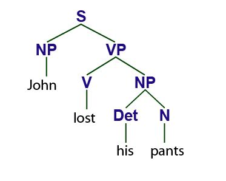
  

  

    
Recipes

    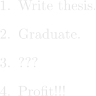
  

  

     
    
Programming languages

     <pre><code data-trim>
def fib(n):
   if n==1 or n==2:
      return 1

   return fib(n-1) + fib(n-2)

print fib(5)
     </code></pre>
  

  

     
    
Mathematics

     
    $i \hbar \frac{ \partial f}  {\partial t} = - \frac{\hbar ^2}{2m}\nabla ^2f + U(x) f$
  

---Right---
##Two criteria:
For a connectionist account of structured representations.

<ol>
<li> Human-scale.</li>
<li> Biologically plausible.</li>
</ol>

---Right---
###Human-scale?
"In the Hitchhiker's Guide to the Galaxy, a fearsome intergalactic battle fleet is accidentally eaten by a small dog due to a terrible miscalculation of scale. I think that a similar fate awaits most of the models proposed by Cognitive Scientists"

-----

<small>Geoff Hinton. Where do features come from? In *Outstanding questions in cognitive science: A
symposium honoring ten years of the David E. Rumelhart prize in cognitive science*. Cognitive Science Society, 2010.

---Right---
Cognitive scientists like to focus on toy problems. But humans deal with
extremely large structured representations, and our models must be able to
account for that.

  

E.g., the size of adult human vocabulary estimated to be 60,000 words.

---------

<small>David Crystal. *Cambridge encyclopedia of the english language.* Cambridge University Press. Cambridge, UK. 2003.</small>

---Right---

###Biologically plausible?
Achieve this under the constraints that the *adult human* brain operates under.
 

  

    
Spiking neurons

    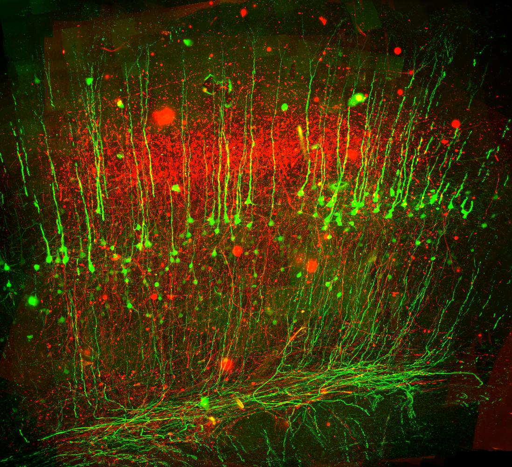
  

  

    
Not too many of them

    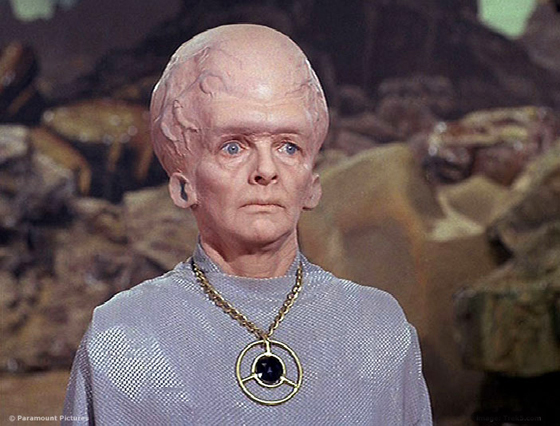
  

 

---Right---
##2. Past approaches
No existing approach is capable of encoding a human-scale knowledge structure in spiking neurons without making implausible neural resource assumptions. We demonstrate this for 3 of the most successful approaches.

---Right---
###Synchrony

---Right---
##Requires more neurons than there are in the human brain
####Because each fact/proposition requires a devoted node

Assume vocabulary with $\hili{1500~nouns}$, $\hili{500~verbs}$, and $\hili{100~neurons~per~node}$.
Neurons required to represent all relations of the form $\hili{verb(noun,~noun)}$:

 
$1500 \times 1500 \times 500 \times 100 = \hili{1.1\times10^{11}~neurons}$

$>$ than the $\hili{50\times10{}^{9}~neurons}$ in cortex$^1$.
 

-----

<small>1. Alan Peters and Edward Jones. *Cerebral Cortex*. Plenum Press.
New York, NY. 1984.</small>

---Right---
###Neural Blackboard Architecture

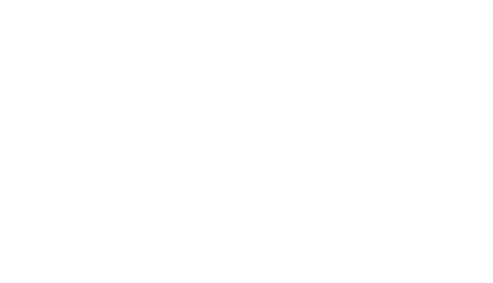

---Right---
##Requires more cortical area allotted to all known-language areas

Conservatively assume: 
60,000 words 
2 roles 
100 assemblies/role 
800 neurons/mesh element 

$60,000$ words $\times 200$ assemblies $\times 800$ neurons/mesh element 
=$96 \times 10^8$ neurons. 

Works out to roughly $480~cm^2$ of cortical area.

All language areas comprise only about $250~cm^2$*.

----

<small>*Chris Eliasmith. *How to Build a Brain.* Oxford University Press. New York, NY.
2013.</small>

---Right---
###Tensor Product

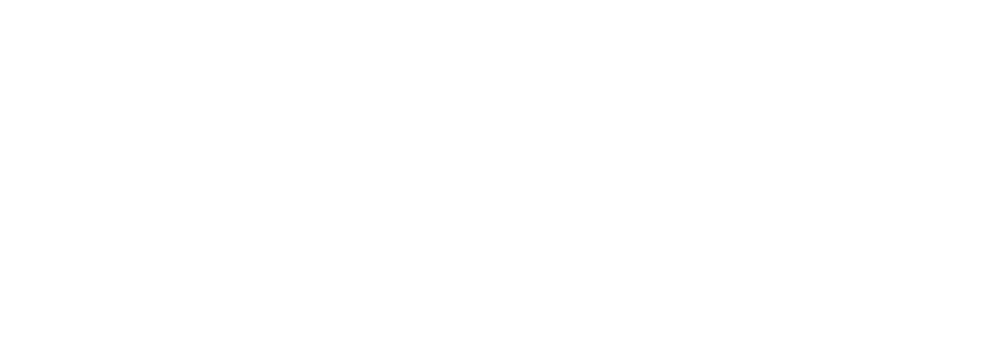

---Right---
##Scales poorly with the depth of the encoded structure
####Because the size of the representation expands for each added level

Assume representations of nouns requires 512 dimensions.
Representing Bill believes that Max is larger than Eve requires: 
$512 \times 512 \times 512 = 12.5 \times 10^7$ dimensions.

Assuming $50$ neurons per dimension gives $6.25 \times 10^9$ neurons. 
Works out to roughly $312~cm^2$ of cortical area, still larger than all language
areas.

---Down---
Short-term vs long-term storage of bindings.
Localist vs distributed.
Classical vs non-classical

---Right---

###So
###Biologically Plausible, Human-scale Knowledge Representation
###is still an open problem

---Right---
##3. Semantic Pointers

---Right---
###Our Goal:
###Encode human-scale knowledge base in a reasonable number of spiking neurons

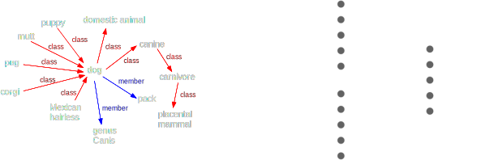

---Right---

###Our Approach:
#Semantic Pointers

###Neurally realized, compressed representations of high-dimensional data.
<ul>
<li>Can be manipulated more easily than high-dimensional representation</li>
<li>Bear systematic relationship to the data they are generated from</li>
<li>Can be decompressed to recover approximation of pre-compressed data</li>
</ul>

----

<small>Chris Eliasmith. *How to Build a Brain.* Oxford University Press. New York, NY.
2013.</small>

---Right---
##Example: Visual Semantic Pointers
###Generative Statistical Models

  

    
Compression

    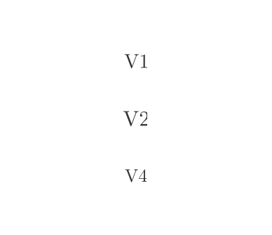
  

  

    
Decompression

    
  

---Right---
##Holographic Reduced Representations
###Semantic Pointers for Structured Representations
A Vector Symbolic Architecture, like tensor products. But with better scaling properties.

---Right---
##HRR Operations
$\mathbf{x}$ and $\mathbf{y}$ are $D$-dimensional vectors.

-----

  

    
Circular Convolution

    $\mathbf{x} \circledast \mathbf{y}$ 
    $(\mathbf{x} \circledast \mathbf{y})\_{(j)} = \sum\_{k = 0}^{D-1} \mathbf{x}\_{(k)} \mathbf{y}\_{(k - j)}$ 
    $\mathbf{x} \circledast \mathbf{y}$ <i>dissimilar</i> to $\mathbf{x}$ and $\mathbf{y}$
  

  

    
Vector Addition

    $\mathbf{x} + \mathbf{y}$ 
    $(\mathbf{x} + \mathbf{y})\_{(j)} = \mathbf{x}\_{(j)} + \mathbf{y}\_{(j)}$
     
    $\mathbf{x} + \mathbf{y}$ <i>similar</i> to $\mathbf{x}$ and $\mathbf{y}$
  

 

  
Involution

  $\inverseop{x}$ 
  $\overline{\mathbf{x}}\_{(j)} = \mathbf{x}\_{(-j)}$ 
  Approximate inverse wrt $\circledast$:
   
  $\mathbf{x} \circledast \mathbf{y} \circledast \inverseop{y} \approx \mathbf{x}$

 
(All indices taken modulo $D$)

---Right---
##Compression
Can use $\circledast$ and $+$ to create semantic pointers storing structured representations. E.g., role-filler structures:  
$\vc{S} = \vc{R\_1} \circledast \vc{F\_1} + \vc{R\_2} \circledast \vc{F\_2} + \vc{R\_3} \circledast \vc{F\_3} $  
where $\vc{S}$, $\vc{R_i}$ and $\vc{F_i}$ are all $D$-dimensional vectors.

---Right---
##Decompression
Can approximately extract constituents of the structure using $\circledast$ and $\inverseop{(\cdot)}$. 
E.g., can reconstruct the vector filling role 1 by computing:  

\begin{align}
&\vc{S} \circledast \inverseop{R\_1}&\\\\

&=(\vc{R\_1} \circledast \vc{F\_1}  + \vc{R\_2} \circledast \vc{F\_2} + \vc{R\_3} \circledast \vc{F\_3} ) \circledast  \inverseop{R\_1}&\\\\

&=\vc{R\_1} \circledast \vc{F\_1} \circledast \inverseop{R\_1} + \vc{R\_2} \circledast \vc{F\_2} \circledast  \inverseop{R\_1} + \vc{R\_3} \circledast \vc{F\_3} \circledast \inverseop{R\_1}  &\color{blue}{\text{(Distributive)}}\\\\

&=\vc{F\_1} \circledast \vc{R\_1} \circledast \inverseop{R\_1} + \vc{R\_2} \circledast \vc{F\_2} \circledast  \inverseop{R\_1} + \vc{R\_3} \circledast \vc{F\_3} \circledast \inverseop{R\_1}  &\color{blue}{\text{(Commutative)}}\\\\

&\approx \color{blue}{\underbrace{\color{white}{\vc{F\_1} + \vc{R\_2} \circledast \vc{F\_2} \circledast  \inverseop{R\_1} + \vc{R\_3} \circledast \vc{F\_3} \circledast \inverseop{R\_1}  }}\_{\text{Similar to}~\vc{F\_1}}}&
\end{align}

---Right---
#WordNet
###A human-scale knowledge base.

###117,659 concepts.

Concepts are nodes, relations are directed, labelled edges between nodes.

5 types of relations: 
$\mathbf{class, instance, substance, member, part}$

---Right---

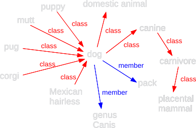

---Right---
##Encode WordNet in semantic pointers.
 
###All vectors have dimensionality $D = 512$   

####Relation-type vectors
Assign random $D$-dimensional vector to each relation-type.  

####ID-vectors
Assign each concept a randomly chosen $D$-dimensional unit vector.  

####Semantic Pointers
Assign each concept another $D$ dimensional role-filler semantic pointer storing the structural relations.

---Right---
Part of the relational structure of *dog* is:  
*dog = class(canine) and member(pack)*  

-----

Semantic pointer *dog* for would be:  
$\hrr{dog} = \vc{class} \circledast \id{canine} + \vc{member} \circledast \id{pack}$

---Right---
Now we can use decompression ($\circledast$ and $\inverseop{(\cdot)}$) to *traverse* an edge in WordNet.

\begin{align}
&\hrr{dog} \circledast \inverseop{class}&\\\\
&=(\vc{class} \circledast \id{canine} + \vc{member} \circledast \id{pack}) \circledast  \inverseop{class}&\\\\
&=\vc{class} \circledast \id{canine} \circledast \inverseop{class} + \vc{member} \circledast \id{pack} \circledast  \inverseop{class}&\color{blue}{\text{(Distributive)}}\\\\
&=\id{canine} \circledast \vc{class} \circledast \inverseop{class} + \vc{member} \circledast \id{pack} \circledast  \inverseop{class}&\color{blue}{\text{(Commutative)}}\\\\
&\approx \color{blue}{\underbrace{\color{white}{\id{canine} + \vc{member} \circledast \id{pack} \circledast  \inverseop{class}}}\_{\text{Similar to}~\id{canine}}}&
%&\approx \underbrace{\id{canine} + \vc{member} \circledast \id{pack} \circledast  \inverseop{class}}\_{\text{Similar to}~\id{canine}}&
\end{align}

---Right---
##Semantic Pointers for Sentences
 
dogs chase cats encoded as: 

 
$\hrr{sentence} = \vc{subject} \circledast \id{dog} + \vc{verb} \circledast \id{chase} + \vc{object} \circledast \id{cat}$

 

Extract constituents:  
$\hrr{sentence} \circledast \inverseop{verb}$ similar to $\id{chase}$

---Right---
##Semantic Pointers for Deep Sentences
 
mice believe that dogs chase cats encoded as:

 
\begin{align}
\hrr{deep~sentence} =~\vc{subject} \circledast \id{mouse} + \vc{verb} \circledast \id{believe}~+\\\\
\vc{object} \circledast  (\vc{subject} \circledast \id{dog} + \vc{verb} \circledast \id{chase} + \vc{object} \circledast \id{cat})
\end{align}

 

Extract constituents:  
$\hrr{deep~sentence} \circledast \inverseop{(\vc{object} \circledast \vc{subject})}$ similar to $\id{dog}$

---Right---
##Two Problems

  

    
1. Result of Decompression is Noisy

     
    $\hrr{dog} \cc{} \inverseop{class} \neq \id{canine}$
    $\hrr{sentence} \cc{} \inverseop{verb} \neq \id{chase}$
  

  

    
2. Prefer SP's over ID-vectors 

     
    $\hrr{dog} > \id{dog}$
  

---Right---
##Associative Memory

Associate pairs of vectors $\pair{\xi_k}{\eta_k}$ for $k = 1 \dots N$.

$\xi_k$ are the address vectors, $\eta_k$ are stored vectors.
Given noisy version of an $\xi$, output corresponding $\eta$.

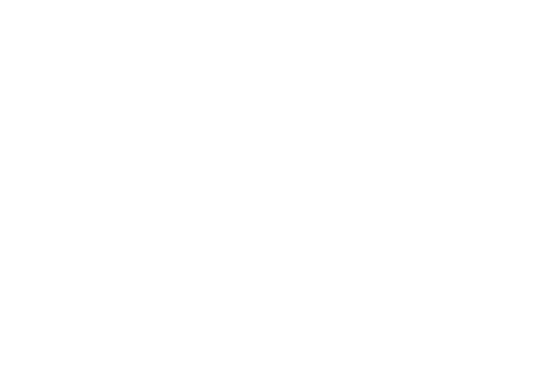

Let $\xi$'s be ID-vectors, $\eta$'s be semantic pointers.

---Down---
###Why ID-vectors?

---Down---
###Decompression statistics

---Right---
##Associative Memory

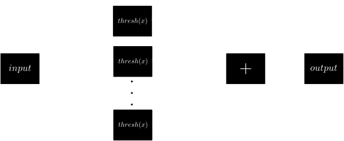

---Right---
##Extraction Algorithm
####Putting it all together

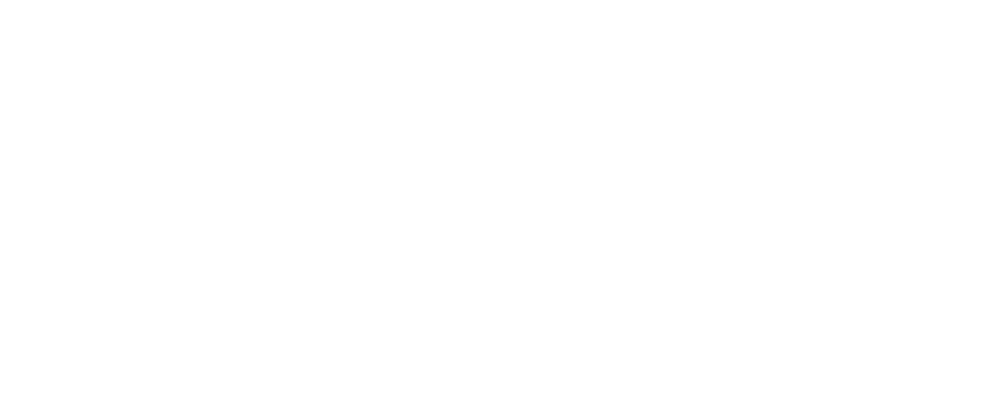

---Right---
##4. Neural Implementation

---Right---
#Neural Engineering Framework
####Activity of populations of neurons represent vectors, connection weight matrices perform transformations on those vectors

---Right---

  

    
Neural Encoding
  
    \begin{align}
      a\_{i}(\mathbf{x})=G\_{i}( \mathbf{e}\_i \mathbf{x} )
    \end{align}
  

  

    
Neural Decoding
  
    \begin{align}
    \widehat{f(\mathbf{x})}=\sum\_{i}a\_{i}\mathbf{(x)}\mathbf{d}^f\_{i}
    \end{align}
  

 

  

    
Finding Decoding Vectors

    Minimize:  
    \begin{align}
      Error=&\ \frac{1}{2}\int(f(\mathbf{x})-\widehat{f(\mathbf{x})})^2d\mathbf{x}\\\\
      =&\ \frac{1}{2}\int(f(\mathbf{x})-\sum\_{i}a\_{i}(\mathbf{x)}\mathbf{d}\_{i}^{f})^{2}d\mathbf{x}
    \end{align}
  

  

    
Derive connection weights

    Implement non-linear function $f$ and linear transformlation $L$.  
    \begin{align}
        \omega\_{ij}=\mathbf{e}\_{j} \mathbf{L} \mathbf{d}\_{i}^f
    \end{align}
  

---Down---
Populations of neurons represent vectors.

Populations have encoding vectors, and respond in proportion to the similarity
of the input vector to their encoding vector.

Populations have decoding vectors which allow us to reconstruct the vector
driving the population, or a function thereof.

Can construct weight matrix between two neural populations in terms of decoding
vectors of pre-synaptic population and encoding vectors of post-synaptic
population.

---Right---

  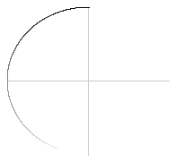
  
  
  
  
  
  
  
  
  

  

  

  

  

  

  

  

  

Input: $\mathbf{x}$, 

Encoding vectors: $\mathbf{e_i}$, 

Neural activity: $a\_{i}(\mathbf{x})=G\_{i}( \mathbf{e}\_i \mathbf{x} )$

---Right---

  
  
  
  
  
  
  
  

  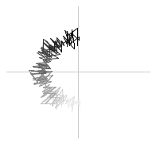
  
$$\hat{\mathbf{x}} = \sum_i d_i^I a_i$$

---Right---

  
  
  
  
  
  
  
  

  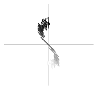
  $$\widehat{f(\mathbf{x})} = \sum_i d_i^f a_i$$

---Right---
##Circular Convolution
Can be written as element-wise multiplication ($\diamond$) in the Fourier space.
$\mathbf{x} \circledast \mathbf{y} = \mathbf{F}^{-1}( \mathbf{Fx} \diamond \mathbf{Fy} )$
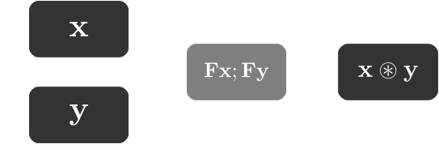

---Right---
##Involution
A permutation, so is a linear operator, and a corresponding matrix $V$. Make
the convolution network compute $\mathbf{x} \cc{} \inverseop{y}$ instead of
$\mathbf{x} \cc{} \mathbf{y}$ with a small adjustment.
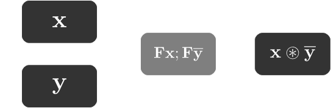

---Right---
##Neural Associative Memory
Neural implementation of associative memory algorithm we saw earlier.
A small population is assigned to each pair $\pair{\xi_k}{\eta_k}$. Each population then has 3 jobs:

<ol>
<li>Compare input to $\xi_k$.</li>
<li>Threshold result.</li>
<li>Multiply $\eta_k$ by result.</li>
</ol>

Output should then be the summation of each of these populations.

---Right---
##Neural Associative Memory
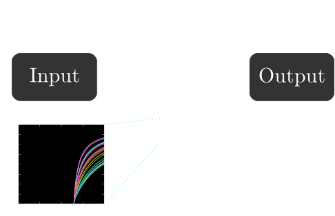

---Right---
##Complete Model
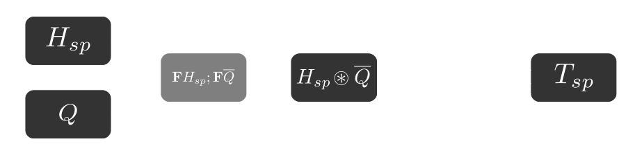
Neural populations labeled with values they represent when
$\hrr{H} = \vc{Q} \cc{} \id{T} + \vc{R} \cc{} \id{U}$ and $\vc{Q}$
given as input.

---Right---
##Neuron Count

50 neurons per dimension, 20 neurons per association population. 

Dark gray populations (512-D): $4 \times 512 \times 50$ 
Light gray population (1028-D): $1 \times 1028 \times 50$ 
Association populations: $117,659 \times 20$ 

Total neurons: $2,506,980$ 
Cortical area: $2,506,980~neurons / 170,000 \frac{neurons}{mm^2}^{\*}$ 
$= 14.7 mm^2$ 
$= 0.147 cm^2$ $<<$ previous approaches

-----

<small>$^{\*}$Chris Eliasmith. *How to Build a Brain.* Oxford University Press. New York, NY.
2013.</small>

---Right---
##5. Results

---Right---

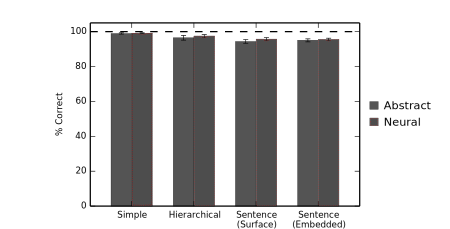

---Right---
##6. Conclusion

1. First biologically plausible neural implementation of a human-scale knowledge-base.
2. Ability to scale can be a useful way to select theories.
3. Encourage theoretical debates to be replaced by concrete, large-scale implementations.

---Right---
##Acknowledgements
Thanks to my readers, members of the CNRGlab, NSERC, AFO.

Visualization of Past Approaches made by Terry Stewart.
NEF visualizations made by Trevor Bekolay and Xuan Choo.

